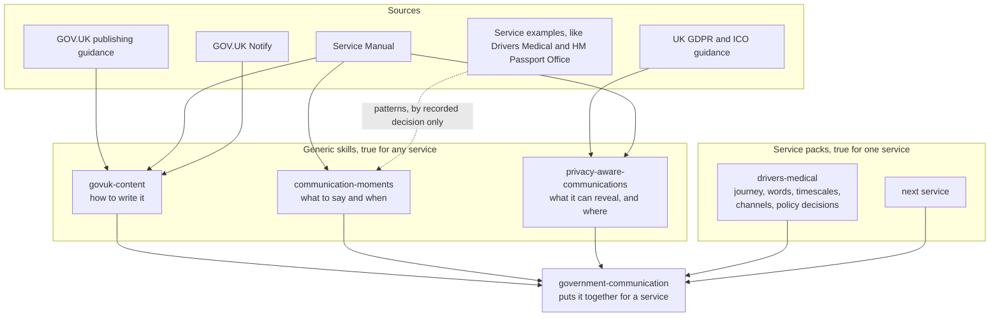
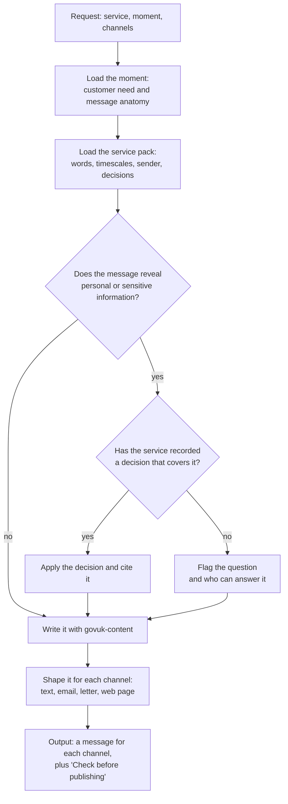
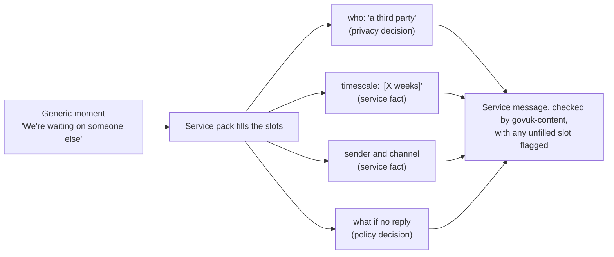
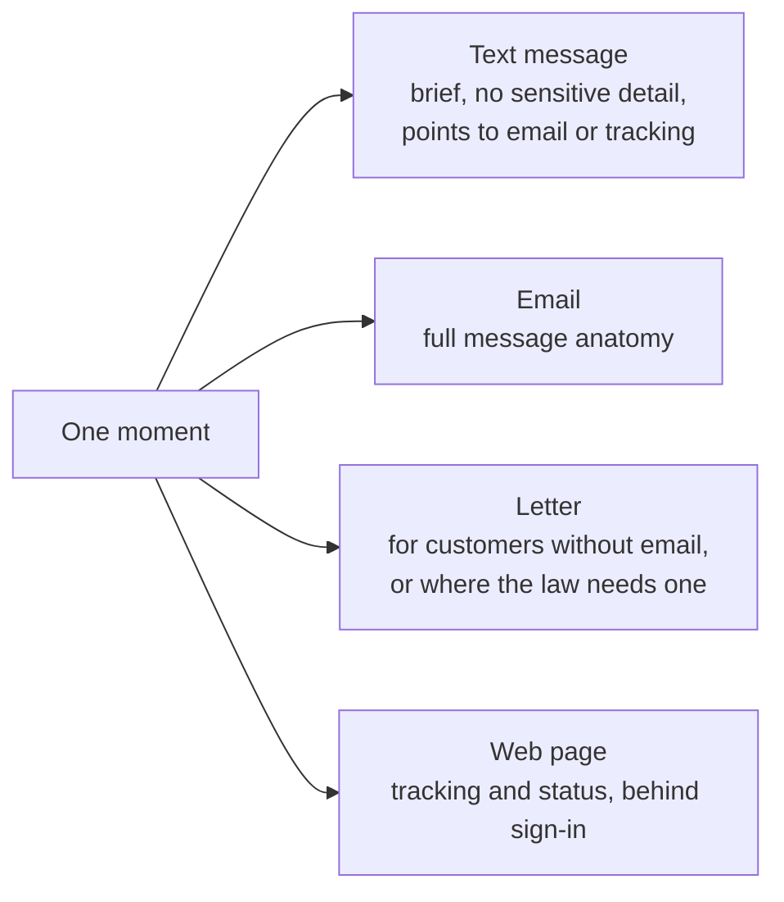

# Architecture

What we are building, how the parts fit together, and why.

Written 6 October 2026, after reviewing the Drivers Medical proactive communications storyboards and HM Passport Office's caseworker guidance "How we communicate with customers".

## The idea

Every government service that handles a customer's case has the same set of communication moments. Something is received, work starts, the service waits on someone, it needs something from the customer, it plans a call, it makes a decision.

If we design those moments well once, a service only has to tailor them: its words, its timescales, its channels and its policy decisions. The skills do the tailoring and check the result.

## Where we are

| Part | Status |
|---|---|
| Repository structure and rules (`CLAUDE.md`) | done |
| `govuk-content` skill: how to write | first version, not yet tested |
| 5 evals for `govuk-content` | written, not yet run |
| Communication moments: what to say and when | proposed in this document |
| `privacy-aware-communications` skill: what a message can reveal | planned |
| Drivers Medical service pack | planned |
| `government-communication` skill: putting it together | planned |

## What the 2 examples show

### Drivers Medical storyboards

The board maps 9 moments in a postal application, each with a customer need, the service event behind it, the benefits to the customer and the service, and a draft email.

The drafts already follow most of the Service Manual: "Dear [firstname lastname]", the reference near the top, "What happens next", "You do not need to do anything now", and a full GOV.UK tracking link. They share one structure, which is the strongest sign that a reusable foundation exists.

The sticky notes record privacy thinking in progress:

- a reference number is personal data
- an internal prefix in the reference should be dropped
- text messages should be brief, with details behind a sign-in or a phone call

The drafts also say "a third party" rather than naming who. That's a deliberate choice to reveal less, and it pulls against the customer need "I want to know what is happening while I wait". This is exactly the kind of question the privacy layer must flag rather than settle.

### HM Passport Office guide

The guide is caseworker guidance, not writing guidance. It's mostly about when and how to contact customers, not wording. It adds 3 things the board does not have:

- **more moments:** approval, issue and delivery, reminders to act, renewal reminders, and what happens if the customer never replies
- **contact rules:** like only calling between 9am and 8pm, 3 call attempts in a day, and set voicemail wording
- **a governance model:** staff build messages from approved templates and preset phrases in a "Comms builder", and must not write free text unless there's no alternative

Its text messages are short pointers, like "We have emailed you about your passport application", with the detail in the email or behind tracking. That matches the Drivers Medical sticky note about keeping texts brief.

Some of its choices are service-specific and should not become generic. For example, its text messages name the person who confirmed the customer's identity. Whether that's acceptable depends on each service's privacy position.

## The foundations: communication moments

These are the moments both examples share, written without any service's words. Each one is a candidate for the generic library.

| Moment | The customer wants to know | Drivers Medical board | HM Passport Office |
|---|---|---|---|
| 1. We've received it | that it arrived, and their reference | 2 | "We've received your documents" |
| 2. Work has started | that someone is working on it | 3 | no |
| 3. We're waiting on someone else | what's happening while they wait | 4 | referee messages |
| 4. Something has changed | that their case has moved on | 5 | identity check messages |
| 5. We need something from you | what to send, how, and by when | 6 | "Remember to send your documents" |
| 6. We've received what you sent | that it arrived, and what's next | 6 (second email) | no |
| 7. We'll contact you | when, how, and that it's genuine | 7 | no |
| 8. Reminder | that the contact is still planned | 8 | appointment reminders |
| 9. We couldn't reach you | what to do now | 9 | voicemail and letter after 3 attempts |
| 10. We've made a decision | the outcome and what it means | not yet designed | "We've approved your application" |
| 11. What happens after the decision | what arrives, and anything they need to do | not yet designed | printing, delivery, "sign your passport" |
| 12. You need to act before a date | that something is due | not yet designed | passport expiry reminders |
| 13. We're closing your case | why, and how to restart | not yet designed | withdrawn applications |

Moments 10 to 13 are the gaps in the Drivers Medical board. Moment 10 is also where the open question about decision language sits.

### What every message contains

The drafts on the board share an anatomy, and the Service Manual asks for the same parts:

1. A headline that says what has happened.
2. A greeting with the customer's full name.
3. The reference.
4. What happens next, and when.
5. What the customer needs to do and by when, or that they do not need to do anything.
6. What happens if they do not act, where that applies.
7. How to track progress or get help.
8. Who it's from.

Each part is a slot. Some slots are generic, like the order. Some are filled by the service, like the timescale. Some need a privacy decision, like how much the headline can say.

## The architecture

### Layers

Each layer has one job, and evals test every layer. Knowledge only flows downwards. A service's choices never flow back up into the generic layers without a recorded decision.

### How a message set is made

The orchestrator takes a service, a moment and the channels, and produces a message for each channel with a list of what still needs checking.

### How a generic moment becomes a service message

### Channels for one moment

Both examples point to the same channel pattern: a brief text that points somewhere safer, with the detail in an email, a letter or behind a sign-in.

Interpretation: this pattern comes from 2 services. It's a strong candidate for the privacy skill, but it stays a hypothesis until a privacy source or a recorded decision supports it.

## What we're building, exactly

The skills don't send messages or replace approval. They produce a draft message set, in a form a service can review and load into a template tool, like GOV.UK Notify.

- **input:** a service, a moment (or a whole journey) and the channels
- **output:** one message for each channel, with placeholders for facts not yet known, and a "Check before publishing" list of open privacy, policy and fact questions
- **review mode:** the same layers, run against an existing message, producing the review table

HM Passport Office's "Comms builder" suggests where this leads: an approved set of templates and preset phrases that staff choose from. The skills help design and check that set. They don't generate free text at the point of contact.

## Decisions needed

### Add a communication moments skill

**Recommendation:** add `communication-moments` as a fourth skill, holding the 13 moments and the message anatomy.

Why it's a separate skill:

- it's not writing guidance, so it doesn't belong in `govuk-content`
- it's not privacy guidance
- it's the foundation the idea depends on

### Rule for moving a pattern into the generic library

`CLAUDE.md` says a service rule only becomes generic when a generic source supports it. Moments are patterns seen across services, and the Service Manual supports the idea of transactional messages but not each moment.

**Recommendation:** a moment can enter the generic library when:

- the Service Manual or another main source supports the need behind it, or it is seen in at least 2 services
- it's written in generic words, with the services that show it named as evidence
- it's marked "hypothesis" until tested with users or confirmed by a content lead

### Phone calls

Moments 7 to 9 are about calls. The messages about calls are in scope. Call and voicemail scripts are not, for now.

### The HM Passport Office guide

**Recommendation:** treat it as evidence for the moments and as an example of how a mature service governs its messages, not as a writing source. Its rules stay with HM Passport Office.

## What not to commit

This repository is public. The board and the passport office screenshots are fine as evidence for this review, but should not be added to the repository as they are.

- the passport office screenshots include people's names and what look like real references
- the board names internal systems and an internal reference format

The Drivers Medical service pack should hold anonymised, cleared extracts only.

## Next steps

1. Agree the decisions above.
2. Run the 5 `govuk-content` evals, adding one of the board's draft emails as a sixth case.
3. Write `communication-moments`, starting with moments 1, 5 and 9, which both examples share most clearly.
4. Start the Drivers Medical service pack by mapping the board's 9 moments to the generic ones, with every privacy note recorded as a hypothesis.
