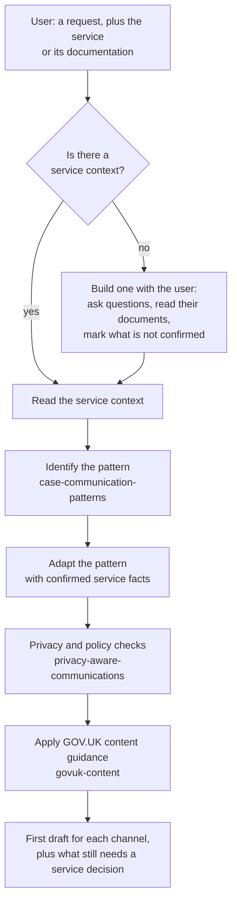
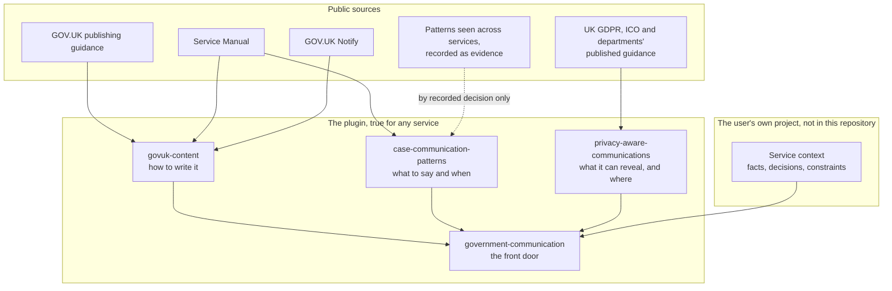
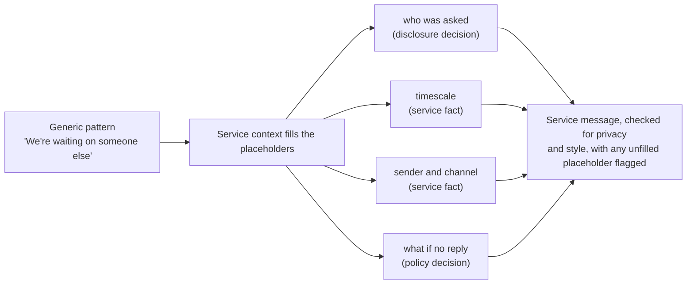
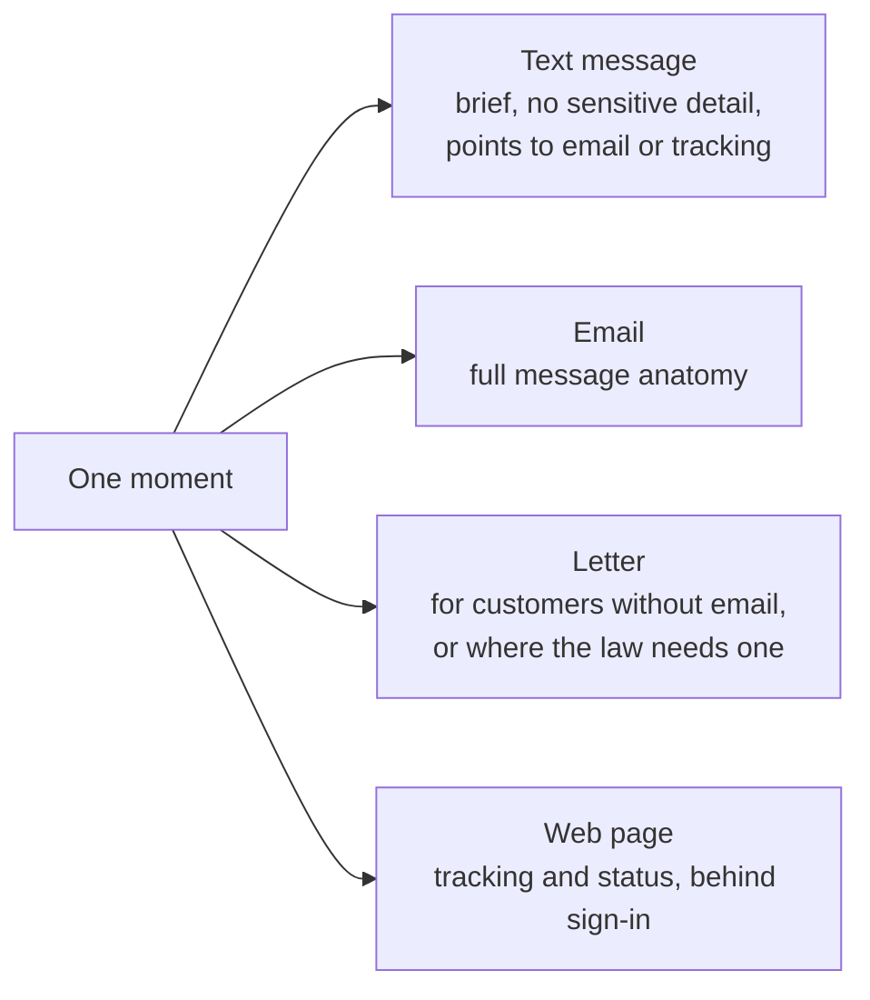

# Architecture

What we are building, how the parts fit together, and why.

Last revised 6 October 2026.

## The idea

Every government service that handles a customer's case has the same communication moments. Something is received, work starts, the service waits on someone, it needs something from the customer, it plans a call, it makes a decision.

If those moments are written well once, as generic patterns, a service only has to supply its facts: its words, timescales, channels and decisions. The plugin adapts the pattern and checks the result.

## One plugin for any service

This repository is service-agnostic. The same installed plugin works for any government service, without changes and without a bespoke skill.

The plugin contains:

- reusable, substantially written case communication patterns
- the reasoning for recognising which pattern fits, and adapting it
- GOV.UK content guidance
- privacy-aware communication guidance
- a front-door skill that combines these

The plugin does not contain:

- any named service's facts, policy, wording or decisions
- skills, folders or packs for named services
- pattern names or examples taken from a named service

Service facts come from a service context. The user supplies it at the point of use, or keeps it in their own project. It never becomes part of the plugin.

## What using it looks like

1. Install the plugin.
2. Tell it about the service, or point it to existing service documentation.
3. The plugin creates the service context, or reads an existing one.
4. It identifies the generic case communication pattern that fits.
5. It adapts the pattern using the service's facts, and only its confirmed decisions.
6. It runs privacy and policy checks.
7. It applies GOV.UK content guidance.
8. It returns a strong first draft, and lists anything that still needs a service decision.



## Layers

Knowledge only flows one way. The service context is read by the plugin, and nothing in it flows back into the generic skills.



## The skills

| Skill | Job | Status |
|---|---|---|
| `government-communication` | the front door. Establishes the service context, then runs the other skills in order | draft, evals run once |
| `case-communication-patterns` | the moments, the patterns for each, and how to recognise and adapt them | draft. 9 moments, 3 modifiers and 1 follow-up, each with a pattern adapted for 3 invented services, evals run once |
| `privacy-aware-communications` | what a message reveals in each channel, applying confirmed decisions and flagging the rest | tested, see `evals/results.md` |
| `govuk-content` | drafts and reviews wording against GOV.UK guidance | tested, see `evals/results.md` |

Each generic skill also works on its own, with or without a service context.

## The service context

A service context is what the plugin needs to know about one service. It lives with the user, not here:

- a file in their own project, like `service-context.md`
- a document in a claude.ai project, or a file they attach
- or facts they give in the conversation

### What it can contain

- what the service does
- its users
- terminology, including internal terms customers should never see
- case states
- known timescales
- available channels
- sender and contact information
- tracking routes
- formal or legally significant communications
- confirmed policy or disclosure decisions
- known constraints
- justified departures from the generic patterns, with the reason

Every section is optional. A missing fact stays a placeholder in the draft and is listed for the service to fill in.

Decisions made by a whole organisation, like a department's disclosure policy, can go in the service context too. The service context says where each one came from.

### How each fact is recorded

Each fact or decision records:

- **kind:** policy decision, communication judgement, precedent or hypothesis
- **source:** a document, meeting or person
- **status:** confirmed, needs confirmation or open question
- **owner:** who can confirm it, if known
- **last checked:** a date

The kinds are:

- **policy decision:** made by someone with authority, so it says who and when
- **communication judgement:** a design decision based on research or experience
- **precedent:** wording that was approved or rejected, with the reason if known
- **hypothesis:** from prototypes or workshops, not yet tested or agreed

The skills use descriptive facts the user gives them, like the service name or contact details, as they are. Decisions, like timescales, consequences, channel and disclosure decisions, are only used if they're marked confirmed. A hypothesis or judgement is never treated as a policy decision.

### When there isn't one yet

The front-door skill helps the user create one:

1. Ask what the service does, and who it's for.
2. Read any documentation the user points to.
3. Draft the service context, in the format above.
4. Mark everything as "needs confirmation" unless the user confirms it.
5. List the open questions, and who could answer each.

Anything taken only from published content stays "needs confirmation". Published content can be out of date or wrong, so it's never treated as the service's policy.

The skill offers the service context back to the user to save in their own project. It's never added to this repository.

The detailed format, with a template, is in the front-door skill, at `skills/government-communication/references/service-context.md`.

## Case communication patterns

A moment is the situation, like "we're waiting on someone else". A pattern is the generic message for it.

Each pattern will contain:

- **recognising it:** the customer's situation, their questions, and how to tell it from similar moments
- **the message:** substantially written, with every service fact as a placeholder, for each channel the moment suits
- **adapting it:** which placeholders the service fills, the variants (like action needed or not), and what must not change
- **checks:** legal effect, privacy questions and common failures
- **evidence:** what supports the pattern, and its status

### What every message contains

The Service Manual asks for these parts, and the examples we reviewed share them:

1. What has happened, as a headline or first line.
2. A greeting with the customer's full name, for emails and letters.
3. The reference.
4. What happens next, and when.
5. What the customer needs to do and by when, or that they don't need to do anything.
6. What happens if they don't act, where that applies.
7. How to track progress or get help.
8. Who it's from.

Each moment also has properties that change how it's written:

- **legal effect:** is this a formal notice? Which messages have legal effect is a service fact. The skills flag it, they don't decide it
- **action:** does the customer need to do something, or nothing? The wording differs sharply
- **sensitivity:** what would the message reveal, and in which channel? This is a privacy question

### How a pattern becomes a service message



### Channels for one moment

The services we reviewed share a channel pattern: a brief text that points somewhere safer, with the detail in an email, a letter or behind a sign-in.



Interpretation: a pattern seen in more than one service. It stays a hypothesis for privacy purposes until a privacy source or a service's confirmed decision supports it.

## Evidence and provenance

The patterns were informed by research into real services. That research is recorded as evidence, not as part of the architecture.

- a published source, like a department's guidance on GOV.UK, is cited by name in the skill's `sources.md`, so anyone can check it
- unpublished prototype work only shows that a moment occurs. No detail is recorded, and the service is not named
- pattern names, skill text and examples are written in generic words, never a named service's words
- a moment's status counts how many services show it, so evidence still matters without naming them

### Adding a moment or pattern

A moment can join the library when:

- a main source supports the need behind it, or it is seen in at least 2 services
- it's written in generic words, with its evidence recorded as above
- it's marked as a proposal until tested with users or confirmed by a content lead

This rule does not apply to privacy. A practice seen in several services is not evidence of what is lawful.

## Privacy and data protection

### Where privacy knowledge comes from

Only public sources inform the privacy skill. Practice that nobody owns, like rules agreed in a workshop, is not a source, and nor are unpublished documents.

| Kind | Examples | Where it lives | Status |
|---|---|---|---|
| The law, the regulator and GOV.UK guidance | UK GDPR, PECR, ICO guidance, Service Standard point 9, Service Manual, GOV.UK Notify security, Government Security Classifications | `privacy-aware-communications` | quoted from the source, not legal advice |
| Departments' published guidance | data protection and disclosure guidance published on GOV.UK | `privacy-aware-communications`, as examples of how accountable organisations apply the law | examples, not rules for other organisations |
| Risk heuristics for each channel | "special category information, or wording that lets it be inferred, is high risk in a text message" | `privacy-aware-communications`, marked as interpretation | describes a risk, not a policy. Needs a confirmed position from each organisation's DPO |
| An organisation's own decisions | a DPO's decision, a privacy notice, a disclosure policy | the user's service context | confirmed only for what it actually says |

There's no single cross-government disclosure policy on GOV.UK. Departments publish their own, and they apply the same principles: check identity before discussing a case, need to know, and lawful authority before telling a third party.

### What the privacy skill does

1. Spots what a message would reveal, in each channel.
2. Checks it against GOV.UK guidance, the law and ICO guidance, like data minimisation, security, and health as special category data.
3. Looks for a confirmed decision in the service context that covers it, and applies and cites it.
4. Otherwise, gives the risk heuristic and its lower-risk option, marked "needs confirmation", or flags the exact question and who should answer it.

For a set of messages, it can list what each moment reveals in each channel. A DPO can review one table instead of every message, and it can feed a DPIA. Their answers become confirmed decisions in the service context.

## How this differs from building an LLM

We're not building or training a language model. We're writing what a general model reads before it starts work.

- **the model:** a general model, like Claude, already knows how to write. Nothing about it changes
- **the skills:** instructions, patterns and quoted guidance in plain Markdown, which the model reads when it does the task
- **the evals:** worked examples that test whether the model, with the skills, does the right thing

Every rule can be traced to a source, fixed by editing a file, and moved to a different model without rebuilding. Unknowns are flagged, not guessed. The model can still make mistakes, so human review and approval stay in place.

## What it produces

The plugin doesn't send messages or replace approval. It produces drafts a service can review and load into a template tool, like GOV.UK Notify.

- **input:** a request, a service context (or what's needed to build one), and the channels
- **output:** one message for each channel, with placeholders for facts not yet known, and a list of open privacy, policy and fact questions
- **review mode:** the same steps, run against an existing message, producing the review table

## Repository structure

```
.claude-plugin/
  plugin.json
  marketplace.json
skills/
  government-communication/        the front door
    SKILL.md
    references/
      service-context.md           the format, and how to build one
  case-communication-patterns/
    SKILL.md
    references/
      moments.md                   the moments, anatomy and evidence
      patterns/                    one substantially written pattern per moment, and the feedback follow-up
    sources.md
  privacy-aware-communications/
  govuk-content/
evals/
  <skill>/                         cases use invented services only
```

There's no `services/` directory. Service contexts belong in the user's own project.

Evals need service facts to test adaptation. They use invented services, written into each case, and never a real service's facts.

## Next steps

`PLAN.md` has the current work package, in order.
