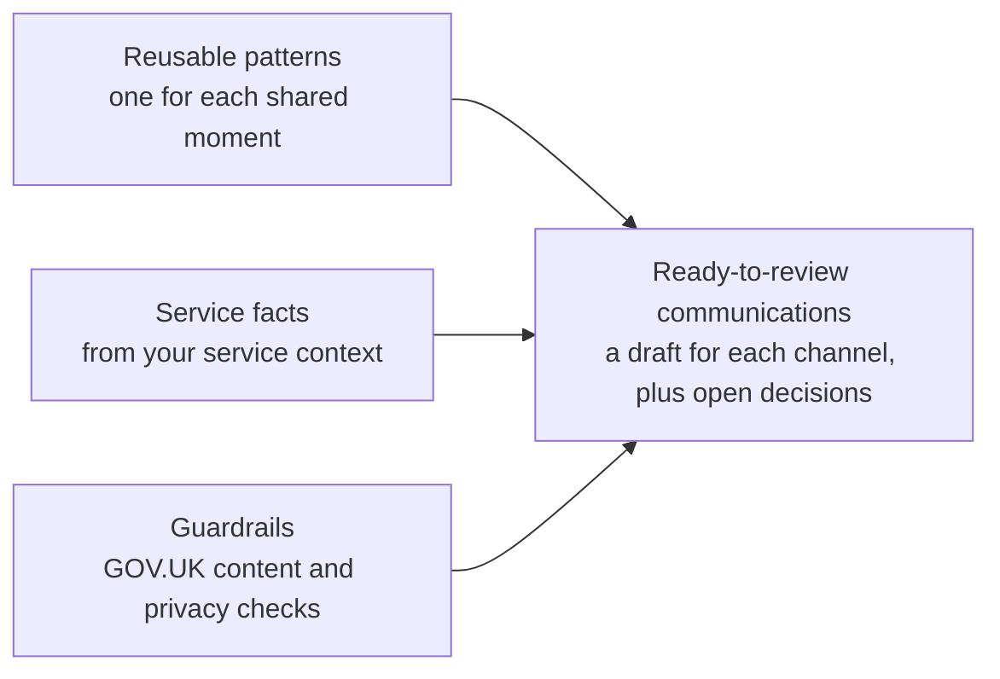

# gov-communication-skills

Agent skills and supporting knowledge for designing and reviewing UK government customer communications.

It works for any government service. The same plugin is used by every service, with no bespoke skill for each one. You tell it about your service, and it adapts generic case communication patterns using your service's facts.

Nothing here is legal advice, and nothing here is an official GOV.UK publication.

## What it does

Government services repeatedly write the same kinds of case communication. The plugin holds generic patterns for them, and adapts each one using your service's facts.



It doesn't invent your policy. Anything your service hasn't decided is listed for a person to decide.

## Install

Choose the AI tool you use. You set it up once, on a computer.

| Option | For | Time |
|---|---|---|
| [Claude skills](#claude-skills) | any Claude plan, including free | 5 minutes |
| [Claude plugin](#claude-plugin) | paid Claude plans and Claude Code | 2 minutes |
| [Microsoft 365 Copilot](#microsoft-365-copilot) | Copilot Chat on a work account | 10 minutes |

The skills and the plugin give you the same thing in Claude. The plugin installs in one go and can update itself.

For Claude, code execution must be switched on. Open Settings, then Capabilities. It's on by default for most people. If it's off, the skills install and then appear to do nothing.

### Claude skills

Works on every Claude plan.

1. Download all 4 skills. Leave them zipped.
   - [government-communication](https://github.com/strachcity/gov-communication-skills/releases/download/downloads/gov-communication-skills-government-communication.zip), the front door
   - [case-communication-patterns](https://github.com/strachcity/gov-communication-skills/releases/download/downloads/gov-communication-skills-case-communication-patterns.zip)
   - [privacy-aware-communications](https://github.com/strachcity/gov-communication-skills/releases/download/downloads/gov-communication-skills-privacy-aware-communications.zip)
   - [govuk-content](https://github.com/strachcity/gov-communication-skills/releases/download/downloads/gov-communication-skills-govuk-content.zip)
2. In Claude, open Customize, then Skills.
3. Select +, then Create skill, and upload one of the zips.
4. Check it's switched on, then repeat for the other 3.
5. Start a new chat.

Add all 4. The front door uses the other 3. If you only want style reviews, `govuk-content` works on its own.

### Claude plugin

All 4 skills in one go. Needs a paid plan (Pro, Max, Team or Enterprise).

[-0f7a52?style=for-the-badge)](https://github.com/strachcity/gov-communication-skills/releases/download/downloads/gov-communication-skills-plugin.zip)

1. Download the plugin. Leave it zipped.
2. In Claude, open Customize, then Plugins.
3. Select Add, then Upload local plugin.
4. Upload the zip, wait for the security scan to finish, then switch it on.
5. Start a new chat.

A zip install stays at the version you downloaded. To get updates automatically, add this repository as a marketplace instead:

1. In Customize, then Plugins, select Add, then Add marketplace.
2. Enter `strachcity/gov-communication-skills` and select Sync.
3. Install "GOV.UK communication skills", then start a new chat.

A plugin added on claude.ai is also available in Claude Code when you sign in with the same account. In Claude Code on its own, run:

```
/plugin marketplace add strachcity/gov-communication-skills
/plugin install gov-communication-skills@gov-communication-skills
```

To try it from a local copy instead, run `claude --plugin-dir path/to/gov-communication-skills`.

### Microsoft 365 Copilot

Builds the skills as an agent in Copilot Chat. It runs on Microsoft's models with the same written rules, and hasn't been tested in Copilot yet. You need permission to create agents: look for Create agent in Copilot Chat's left-hand panel. If it isn't there, ask your IT service.

[-0f7a52?style=for-the-badge)](https://github.com/strachcity/gov-communication-skills/releases/download/downloads/gov-communication-skills-copilot.zip)

1. Download the Copilot version and unzip it. On Windows, right-click it and choose Extract All. On a Mac, double-click it. Leave the 4 skill zips inside it zipped.
2. In Copilot Chat, select Create agent. If it asks you to describe your agent, select Skip, or choose Configure instead of Describe.
3. In Name, enter "GOV.UK communications".
4. In Description, enter "Drafts and reviews UK government customer communications using generic case patterns, GOV.UK style and privacy checks. Uses your service's facts and flags anything not decided."
5. Open "1 Paste into Instructions.txt", copy everything in it, and paste it into Instructions. Check the last words are "Open Government Licence v3.0."
6. Under Skills, upload each zip in "2 Upload these 4 skills", one at a time. Don't unzip or rename them.
7. If there's no Skills option, upload the 4 files in "3 No Skills option - upload these as knowledge instead" under Knowledge. If there's no upload option either, skip this step. The agent works from the instructions alone, with less depth.
8. Switch off web search, Create images and Discourage model knowledge.
9. Select Create, then try asking for a message for your service.

Updates aren't automatic. To update, download again and repeat the steps.

### If it goes wrong

- installed but nothing happens: in Claude, check code execution is on and start a new chat
- you have a folder, not a zip: Safari on a Mac unzips downloads. For Claude, right-click the folder, choose Compress, and upload the new zip
- no Upload local plugin option: use [Claude skills](#claude-skills) instead
- Copilot can't find the files: you're looking inside the zip. Unzip it first, then upload from the folder
- Copilot instructions cut short: clear the box, paste again, and check the last words

The full install guide, with more help, is in `docs/install.html`.

### Using it

Claude uses the skills when a task fits, or you can ask for one by name, like "use govuk-content to review this email".

## Using it for your service

1. Install the plugin.
2. Tell it about your service, or point it to your service's documentation.
3. It creates a service context, or reads the one you already have.
4. It finds the generic case communication pattern that fits your request.
5. It adapts the pattern using your service's confirmed facts.
6. It runs privacy and policy checks.
7. It applies GOV.UK content guidance.
8. It returns a first draft, and lists anything that still needs a decision from your service.

The service context holds your service's facts and decisions, like its terminology, case states, timescales, channels, sender details and confirmed policy or disclosure decisions. Keep it in your own project, not in this repository. `ARCHITECTURE.md` describes what it can contain.

## How the repository is organised

- `skills/`: one folder per skill. Each skill holds its own guidance in `references/` and lists its sources in `sources.md`
- `evals/`: worked examples that test whether the skills behave correctly, one folder per skill. They use invented services only
- `ports/`: builds the downloads and the Microsoft 365 Copilot version from `skills/`. See `ports/README.md`

There's no folder for any named service. Each directory has a README that sets out what belongs there and what does not.

## Skills

| Skill | What it does | Status |
|---|---|---|
| `government-communication` | the front door. Helps you create a service context, then uses the other skills to draft or review a whole communication | draft, evals run once, see `evals/results.md` |
| `case-communication-patterns` | the 9 moments case-based services share, a substantially written pattern for each, a feedback follow-up, and how to recognise and adapt them | draft. Every pattern adapted for 3 invented services, evals run once, see `evals/results.md` |
| `privacy-aware-communications` | lists what a message reveals in each channel, applies confirmed decisions, flags the rest, and drafts the communications part of a DPIA | tested, see `evals/results.md` |
| `govuk-content` | drafts and reviews content against GOV.UK guidance, and flags privacy and policy questions without answering them | tested, see `evals/results.md` |

## Rules that keep it service-agnostic

- no skill refers to a named service, or uses a named service's words
- service facts come from the user's service context, at the point of use
- a service context can narrow generic guidance, but must say so and give a reason
- nothing from a service context is added to the plugin without a recorded decision and a generic source

## Working here

Read `CLAUDE.md` before adding or changing anything. It covers how knowledge is added, where it goes, and what to do when a position is not known. `ARCHITECTURE.md` explains what we are building and how the parts fit. `PLAN.md` has the build plan.

No build step to use it, no package manager, no framework. Everything is Markdown, except 2 small scripts:

- `python3 evals/text-message-lengths.py` checks every text message baseline fits in one text
- `python3 ports/build.py` builds the downloads. A GitHub Action runs it for you when a skill changes

## Licence

This work is licensed under the [Open Government Licence v3.0](https://www.nationalarchives.gov.uk/doc/open-government-licence/version/3/). The full text is in `LICENSE`.

Copyright 2026 strachcity and contributors.

You can:

- use it in your service, team or department
- copy, publish and share it
- edit, adapt and build on it

As long as you credit it. Use this statement, or link to it:

> Contains material from gov-communication-skills (https://github.com/strachcity/gov-communication-skills), licensed under the Open Government Licence v3.0.

Some files quote GOV.UK guidance and other public sector information. That material stays under its own licence, usually the Open Government Licence v3.0 too. Each skill's `sources.md` says where it came from.
